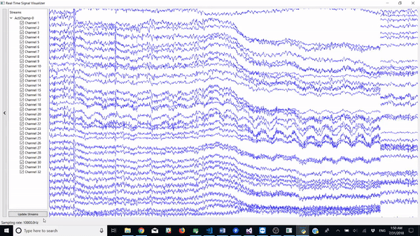

# SigVisualizer

SigVisualizer is a PyQt5 GUI application that visualizes electroencephalogram signals streamed from [__lab streaming layer__ (LSL)](https://github.com/sccn/labstreaminglayer "LabStreamingLayer (LSL)") in real time.

## Requirements
* Python 3.x
* PyQt5

## License

GNU General Public License v3.0; see [LICENSE](LICENSE).

This component is the [SigVisualizer](https://github.com/labstreaminglayer/App-SigVisualizer)
application with security-status support added, distributed as a component of
the Secure LSL monorepo. Its upstream is GPLv3, so this component remains GPLv3,
and the security integration added here (which reads stream security status
through the public LSL API and contains no cryptographic implementation) is
likewise GPLv3. It is aggregated with the other components under GPLv3 section 5;
see COMPONENT LICENSING POLICY in the repository-root LICENSE.
