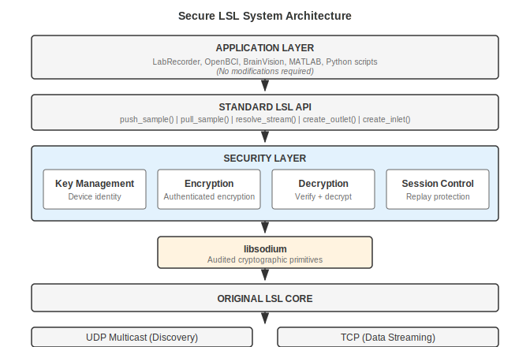

# Architecture Overview

Secure LSL integrates security at the core library level, making it transparent to all applications.

---

## System Architecture

The security layer sits between the standard LSL API and the original LSL core. Applications call the same functions as before; encryption and authentication happen automatically inside the library.



**Key layers:**

- **Application Layer** -- Dynamically linked LSL applications (pylsl, MATLAB, LabRecorder) work by pointing to the new library. Statically linked C++ apps need recompilation.
- **Standard LSL API** -- The familiar `push_sample()`, `pull_sample()`, and `resolve_stream()` interface remains identical.
- **Security Layer** -- Handles key management, authenticated encryption, decryption with verification, and session control including replay protection.
- **libsodium** -- All cryptographic operations use [libsodium](https://libsodium.org/), an extensively audited library used by Signal, WireGuard, and other security-critical projects.
- **Original LSL Core** -- Stream discovery (UDP multicast) and data streaming (TCP) operate as before, with security metadata added to discovery responses and encrypted payloads on data connections.

---

## How It Fits Together

1. **Discovery**: When an outlet advertises a stream, security metadata (enabled status, public key fingerprint) is included in the UDP discovery response.
2. **Connection**: During TCP connection setup, both sides exchange security credentials and derive a unique session key for that connection.
3. **Streaming**: Each data chunk is encrypted with authenticated encryption before transmission and verified on receipt. Replay protection ensures old packets cannot be re-injected.

---

## Configuration

Security settings are stored in LSL's standard configuration file (`lsl_api.cfg`):

```ini
[security]
enabled = true
private_key = base64_encoded_private_key
key_created = 2025-12-05T19:00:00Z
session_key_lifetime = 3600  ; 1 hour in seconds (default)
```

Configuration file search order:

1. `$LSLAPICFG` environment variable (if set)
2. `./lsl_api.cfg` (current directory)
3. `~/.lsl_api/lsl_api.cfg` (user home)
4. `/etc/lsl_api/lsl_api.cfg` (system-wide)

---

## Dependencies

### libsodium

Secure LSL uses [libsodium](https://libsodium.org/) (version 1.0.18 or later) for all cryptographic operations. libsodium is:

- Extensively audited
- Constant-time implementations (side-channel resistant)
- Available on all major platforms (macOS, Linux, Windows, ARM)
- Used by Signal, WireGuard, and many security-critical projects

---

## Next Steps

- [How It Works](../security/how-it-works.md) -- User-friendly explanation of the encryption
- [Security Model](../security/security-model.md) -- Threat model and compliance details
- [API Reference](../api/c-api.md) -- Using the security API
